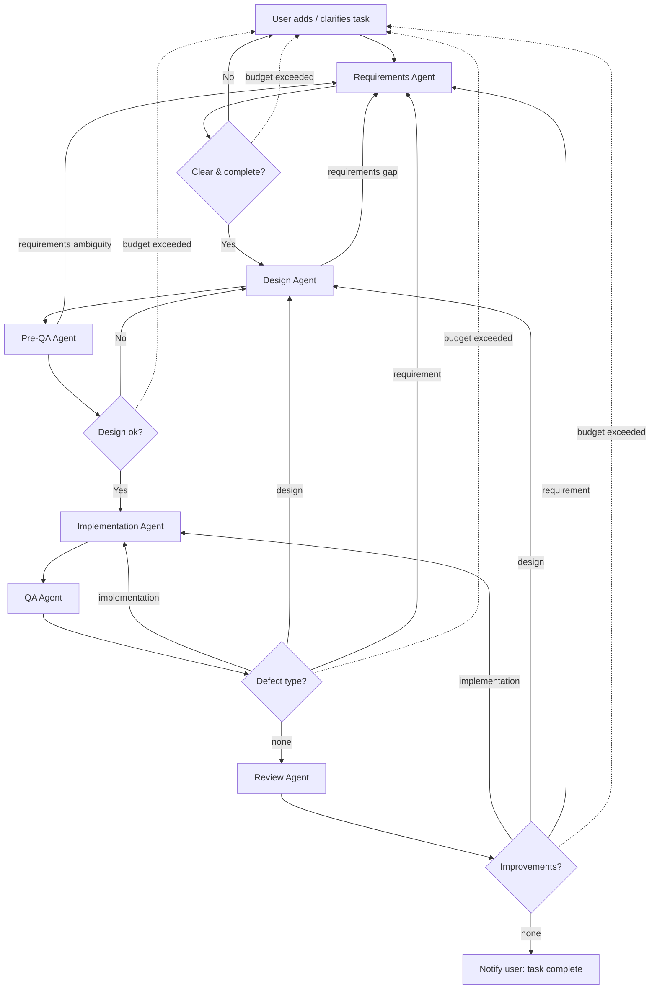

# Multiagent workflow for SDLC
This project is a simple experiment to demonstrate how multiple agents can work together to automate the software development lifecycle (SDLC). The goal is to create a workflow where different agents handle various stages of the SDLC, such as requirements gathering, design, implementation, testing, and deployment.

## Agents
Workflow consists of the following agents passing the work from one to another:
1. **Requirements Agent**: Gathers and analyses requirements. May ask clarifying questions. Owns the requirements document.
2. **Design Agent**: Creates design document of the solution. Owns the design document.
3. **Pre-QA Agent**: Prepares test cases, discovers potential issues, and provides feedback to the design or requirements agent.
4. **Implementation Agent**: Implements the solution based on the design document.
5. **QA Agent**: Tests the implementation and reports defects to the stage that owns them.
6. **Review Agent**: Reviews the final implementation and provides feedback for improvements.

## Principles
Feedback in an SDLC rarely travels back exactly one stage. A test case written by Pre-QA may reveal a
requirements ambiguity; a failing QA run may point to a wrong design rather than buggy code. The
workflow therefore follows four routing principles instead of only looping to the previous stage:

- **Route to the owner, not the neighbor.** When any agent discovers a problem, it is classified by
  type — *requirement*, *design*, or *implementation* defect — and routed to the stage that owns that
  type, however many stages upstream that is. Agents do not guess answers to fill a gap they cannot
  own.
- **Anyone can escalate to the user.** A genuine requirements ambiguity discovered at any stage routes
  back through the Requirements Agent to the user. This path is gated: only true ambiguities reach the
  user, not routine design or implementation defects.
- **Iteration budget + human escalation.** Every backward loop has a maximum-iteration budget. When a
  loop exhausts its budget (e.g. Design and Requirements ping-ponging), the task escalates to the user
  instead of looping forever.
- **Requirements & Design docs are versioned, living artifacts.** The Requirements Agent owns the
  requirements document and the Design Agent owns the design document. When an upstream document is
  amended, the dependent downstream stages re-run against the new version.

## Shared artifacts
Two versioned documents flow through the workflow: the **requirements document** (owned by the
Requirements Agent) and the **design document** (owned by the Design Agent). Only the owning agent may
amend its document. Amending an upstream document invalidates the work of dependent downstream stages,
which re-run against the updated version.



## Orchestrator
The diagram is enforced by [orchestrator.py](orchestrator.py) — a small deterministic state machine,
because **an LLM must never be the thing that enforces a loop budget**: agents can't reliably count
their attempts across separate invocations. Control flow lives in code; the agents are stateless
workers that each do one job and return a machine-readable *verdict*. The orchestrator reads the
verdict, updates externally-persisted state, and decides retry-vs-advance-vs-escalate.

- **States** are the diagram's nodes (`REQUIREMENTS` … `REVIEW`, plus terminal `DONE` /
  `ESCALATE_USER`). The transition table lives in `transition()`.
- **Verdict** (what every agent returns): `{"decision": "advance|needs_work|unclear",
  "defect_type": "requirement|design|implementation|null", "summary": "..."}`. Routing keys off
  `defect_type` so a problem goes to its *owner* stage, not merely the previous one.
- **State** persists per task in `state/<task_id>/state.json` as an append-only history (crash
  recovery + an audit trail for debugging ping-pong). The versioned `requirements.md` / `design.md`
  artifacts live in the same directory.
- **Budgets** are deterministic: each backward edge increments a counter; when a loop exceeds its
  budget the next state becomes `ESCALATE_USER` instead of retrying.

Agents are invoked via the Claude CLI (`claude -p`, see `prompts/`), but for development the agents
are **stubbed** with scripted verdict sequences (`scenarios/`) so the whole machine can be exercised
deterministically with zero API calls:

```bash
# happy path -> DONE
python3 orchestrator.py --task demo --stub-scenario scenarios/happy.json

# a loop that exhausts its budget -> ESCALATE_USER
python3 orchestrator.py --task demo --stub-scenario scenarios/budget_exhausted.json --budget 3

# Pre-QA discovers a requirements gap -> routes to Requirements, then completes
python3 orchestrator.py --task demo --stub-scenario scenarios/prega_finds_requirement_gap.json
```
