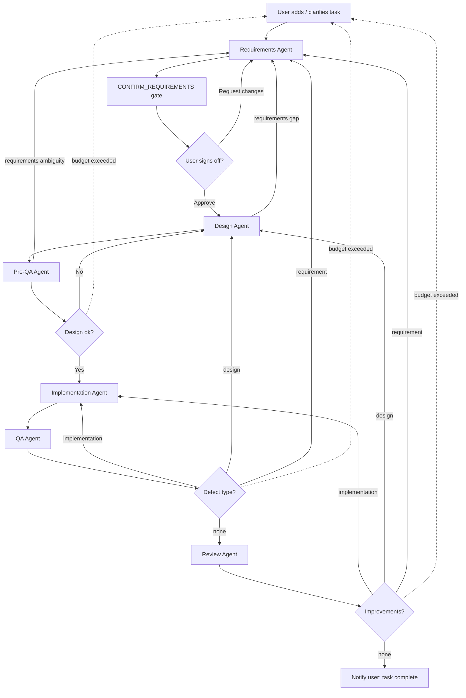

# Multiagent workflow for SDLC
This project is a simple experiment to demonstrate how multiple agents can work together to automate the software development lifecycle (SDLC). The goal is to create a workflow where different agents handle various stages of the SDLC, such as requirements gathering, design, implementation, testing, and deployment.

## Agents
Workflow consists of the following agents passing the work from one to another:
1. **Requirements Agent**: Gathers and analyses requirements, surfacing every assumption and open question. Owns the requirements document, which a human must approve at the confirm-requirements gate before Design begins.
2. **Design Agent**: Creates design document of the solution. Owns the design document.
3. **Pre-QA Agent**: Prepares test cases, discovers potential issues, and provides feedback to the design or requirements agent.
4. **Implementation Agent**: Implements the solution based on the design document.
5. **QA Agent**: Tests the implementation and reports defects to the stage that owns them.
6. **Review Agent**: Reviews the final implementation and provides feedback for improvements.

Each stage is an idiomatic **Claude Code subagent** defined in [.claude/agents/](.claude/agents/)
(`sdlc-requirements`, `sdlc-design`, `sdlc-pre-qa`, `sdlc-implementation`, `sdlc-qa`, `sdlc-review`).
The subagent files carry the persona and the verdict contract, and each references the engineering
guidelines it should apply (see [Guidelines](#guidelines)).

## Principles
Feedback in an SDLC rarely travels back exactly one stage. A test case written by Pre-QA may reveal a
requirements ambiguity; a failing QA run may point to a wrong design rather than buggy code. The
workflow therefore follows four routing principles instead of only looping to the previous stage:

- **Route to the owner, not the neighbor.** When any agent discovers a problem, it is classified by
  type — *requirement*, *design*, or *implementation* defect — and routed to the stage that owns that
  type, however many stages upstream that is. Agents do not guess answers to fill a gap they cannot
  own.
- **Anyone can escalate to the user.** A genuine requirements ambiguity discovered at any stage routes
  back through the Requirements Agent to the user. This path is gated: only true ambiguities reach the
  user, not routine design or implementation defects.
- **Iteration budget + human escalation.** Every backward loop has a maximum-iteration budget. When a
  loop exhausts its budget (e.g. Design and Requirements ping-ponging), the task escalates to the user
  instead of looping forever.
- **Requirements & Design docs are versioned, living artifacts.** The Requirements Agent owns the
  requirements document and the Design Agent owns the design document. When an upstream document is
  amended, the dependent downstream stages re-run against the new version.

## Shared artifacts
Two versioned documents flow through the workflow: the **requirements document** (owned by the
Requirements Agent) and the **design document** (owned by the Design Agent). Only the owning agent may
amend its document. Amending an upstream document invalidates the work of dependent downstream stages,
which re-run against the updated version.



## Orchestrator
The diagram is enforced by [orchestrator.py](.claude/scripts/orchestrator/orchestrator.py) — a small deterministic state
machine, because **an LLM must never be the thing that enforces a loop budget**: agents can't reliably
count their attempts across separate invocations. Control flow lives in code; the agents are stateless
workers that each do one job and return a machine-readable *verdict*. The orchestrator reads the
verdict, updates externally-persisted state, and decides retry-vs-advance-vs-escalate.

The orchestrator is a pure **instruction printer** — it never launches agents itself. The whole
pipeline runs in **one Claude session**: the session asks the orchestrator for the next step
(`next`), dispatches the named subagent via the Task tool (visible in the UI), and feeds the verdict
back (`record`). Each subagent writes its substance to files (its owned artifact + `verdict.json`) and
returns only a terse ack — the orchestrator reads the verdict file and narrates the next step plus a
`last_summary` for the session to relay, so the driving context stays lean and the orchestrator stays
the single source of routing truth.

- **States** are the diagram's nodes (`REQUIREMENTS` … `REVIEW`, the human-approval pause state
  `CONFIRM_REQUIREMENTS`, plus terminal `DONE` / `ESCALATE_USER`). The transition table lives in
  `transition()`.
- **Human-approval gate.** Requirements never advance straight to Design: the run always pauses at
  `CONFIRM_REQUIREMENTS` (status `awaiting_approval`) so a human can review `requirements.md` — every
  assumption included — and either approve it or request changes. The `confirm` subcommand resolves the
  gate; requested changes route back to Requirements (which receives the change text as feedback) and
  return to the gate. Stub runs auto-approve the gate so the machine stays exercisable without a human.
- **Verdict** (what every agent returns): `{"decision": "advance|needs_work|unclear",
  "defect_type": "requirement|design|implementation|null", "summary": "..."}`. Routing keys off
  `defect_type` so a problem goes to its *owner* stage, not merely the previous one.
- **State** persists per task in `.agents/<task_id>/state.json` as an append-only history (crash
  recovery + an audit trail for debugging ping-pong), committed to the repo as a work artifact. The
  versioned `requirements.md` / `design.md` artifacts live in the same directory.
- **Budgets** are deterministic: each backward edge increments a counter; when a loop exceeds its
  budget the next state becomes `ESCALATE_USER` instead of retrying.

For development the state machine is exercised with **stubbed** scripted verdict sequences
(`test/scenarios/`) so the whole machine can be run deterministically with zero API calls and no
subagents, via `run --stub-scenario`:

```bash
cd .claude/scripts/orchestrator

# happy path -> DONE
python3 orchestrator.py run --task demo --restart --stub-scenario test/scenarios/happy.json

# a loop that exhausts its budget -> ESCALATE_USER
python3 orchestrator.py run --task demo --restart --stub-scenario test/scenarios/budget_exhausted.json --budget 3

# Pre-QA discovers a requirements gap -> routes to Requirements, then completes
python3 orchestrator.py run --task demo --restart --stub-scenario test/scenarios/prega_finds_requirement_gap.json
```

## Guidelines
Engineering best practices live in [guidelines/](guidelines/) at the repo root: a shared
[core.md](guidelines/core.md) (KISS, DRY, YAGNI, SOLID, clear naming, error handling, security,
testing mindset) that every stage applies, plus deeper per-domain files
(`requirements.md`, `design.md`, `testing.md`, `implementation.md`, `review.md`). Each subagent
references `core.md` and its stage-specific file and is instructed to read and apply them before
starting. Keep these files short and scannable.

## Adding & running a task
Real runs happen **inside a Claude Code session** through the slash commands in `.claude/commands/` —
they drive the pipeline by asking the orchestrator for each step and dispatching the subagents:

- `/add-task <task-id> <requirements...>` — create the task workspace (does not start it).
- `/run-task <task-id>` — drive the pipeline: `next` → dispatch subagent → `record`, looping until
  done / escalate / the requirements gate.
- `/confirm-task <task-id> [--approve | --request-changes "..."]` — sign off at the requirements gate,
  then continue the driver loop.
- `/status-task <task-id>` — summarize the task's state.

Under the hood these call the orchestrator subcommands. State defaults to `.agents/` at the repo
root regardless of cwd, so the commands can run from anywhere; invoked from the repo root:

```bash
# Add a task: creates .agents/<id>/task.md and an initial state.json (stdin or --from PATH).
echo "Build a CLI that adds two numbers" | python3 .claude/scripts/orchestrator/orchestrator.py add --task calc

# Ask for the next step (read-only; launches nothing). Returns a run_agent / await_approval /
# done / escalate instruction the driver acts on.
python3 .claude/scripts/orchestrator/orchestrator.py next --task calc

# After a subagent writes verdict.json, record it: advances state, enforces budgets, prints the
# next instruction plus last_summary.
python3 .claude/scripts/orchestrator/orchestrator.py record --task calc

# Resolve the requirements approval gate, then the driver continues from the printed instruction.
python3 .claude/scripts/orchestrator/orchestrator.py confirm --task calc --approve
python3 .claude/scripts/orchestrator/orchestrator.py confirm --task calc --request-changes "target a CLI, not a web app"

# Check where a task is: current stage, status, loop counters, recent history.
python3 .claude/scripts/orchestrator/orchestrator.py status --task calc
```
